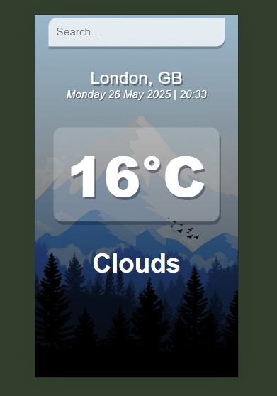

# Weather App


---
## Project Overview
This is a **responsive weather app** built using **React JS** that allows users to search for the current
weather conditions of any city in the world. The app fetches real-time weather data using the
[OpenWeatherMap API](https://openweathermap.org/api) and displays relevant information such as
temperature, weather description, and location details in a user-friendly interface.
---
## Features
- **City Search**: Users can search for any city to get real-time weather updates.
- **Weather Details**: Displays temperature, description, humidity, and wind speed.
- **Dynamic UI**: Changes background/image based on weather conditions.
- **Responsive Design**: Optimized for both desktop and mobile view.
---
## How It Works
The app is built using `Create React App`. It includes:
- A `search` bar that updates the UI based on user input
- Fetch requests to the OpenWeatherMap API upon form submission
- Conditional rendering of weather cards only when data is available
- Component-based structure for better modularity (`App.js`, `WeatherCard.js`, etc.)
---
## Getting Started
To run this project locally:
```bash
# 1. Clone the repository
git clone https://github.com/khalildabbah/Weather_App.git
cd Weather_App
# 2. Install dependencies
npm install
# 3. Start the development server
npm start
```
Then open your browser and go to:
[http://localhost:3000](http://localhost:3000)
---
## Notes
- Youll need an **API key** from OpenWeatherMap.
- Add your key in the appropriate location in your code (`.env` or inside the fetch URL).
---
## Built With
- [React](https://reactjs.org/)
- [OpenWeatherMap API](https://openweathermap.org/api)
- HTML + CSS
---
## License
This project is licensed under the MIT License.
